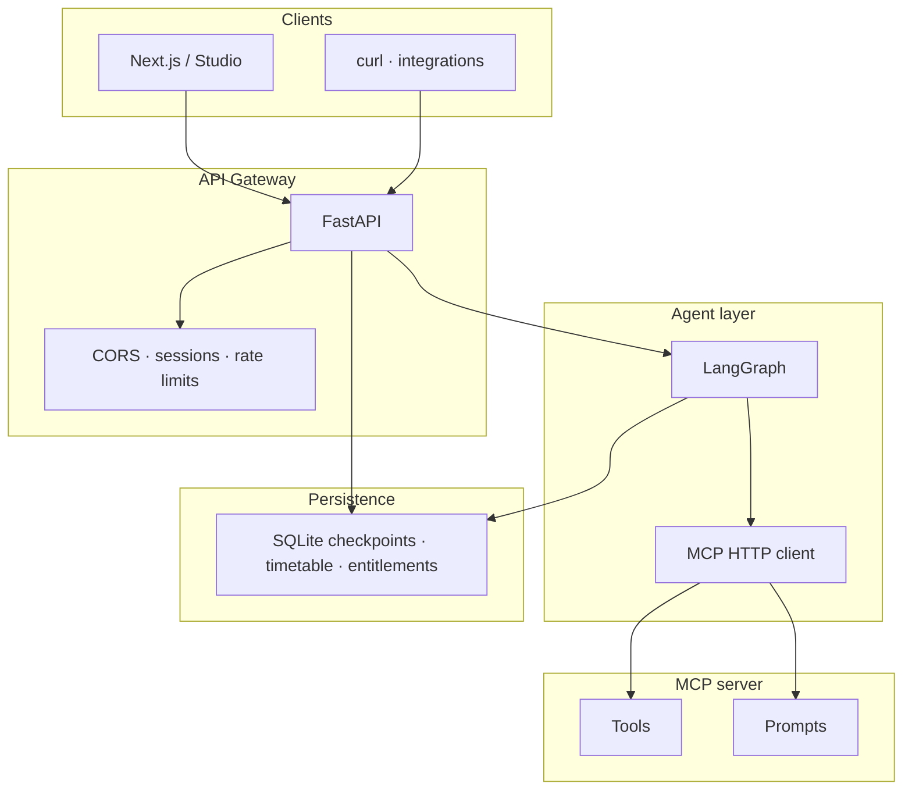

<div align="center">


<br/>

[](https://www.python.org/)
[](https://fastapi.tiangolo.com/)
[](https://nextjs.org/)
[](https://langchain-ai.github.io/langgraph/)

<br/>

<!-- Animated tagline (SVG) — renders on GitHub -->


<br/>

**Personalised coaching · Document intelligence · Checkpointed threads · Clerk-ready auth**

[**Quick start**](#-quick-start) · [**Architecture**](#-architecture) · [**Studio UI**](#-studio--nextjs-frontend) · [**Configuration**](#-configuration) · [**API**](#-api-essentials) · [**Deploy**](./DEPLOY.md)

</div>

---

## Overview

**Study Coach** is a vertical AI platform for **African education**: tutoring that respects **GES / SHS / WASSCE / tertiary** context, **document uploads** for your own materials, and **durable conversation memory** so learners can resume after restarts. The stack is built for clear separation between **HTTP gateway**, **tool & prompt surface (MCP)**, and **agent orchestration (LangGraph)**.

| | |
|:---|:---|
| 🎯 **Focus** | Ghana-first curricula; extensible to the wider continent |
| 🧠 **Agent** | ReAct loop with MCP tools, optional supervisor + multi-agent team router |
| 💾 **Memory** | SQLite or in-memory checkpointers; `thread_id` scoped state |
| 🌐 **Studio** | Next.js 15 dashboard, coach, timetable, assessment, subscription panel |

---

## Architecture



- **MCP** — Central tool & prompt registry ([Model Context Protocol](https://modelcontextprotocol.io/)).
- **LangGraph** — Stateful graphs, `thread_id`, streaming.
- **FastAPI** — Public API: workflow, uploads, history, SSE, timetable, webhooks.

<details>
<summary><strong>Legacy ASCII sketch</strong></summary>

```text
Client → POST /workflow → FastAPI → MCP Client → FastMCP (tools + prompts)
                              ↓
                         LangGraph ↔ LLM
```

</details>

---

## Features

- **Assessment → profile** — Short questionnaire feeds **`learner_profile`** on the first turn of a new thread.
- **Coach** — `POST /workflow`, `POST /workflow/stream` (SSE tokens), optional **`coaching_mode`**: `full` | `hints`.
- **Studio** — `/studio` dashboard, `/studio/chat`, `/studio/timetable`, `/studio/library`, `/studio/settings` (notifications + subscription status).
- **Timetable** — Import, weekly grid, prep/rest nudges; optional **SendGrid**.
- **Auth** — Optional gate (`APP_ACCESS_CODE`), API keys, or **Clerk** (`CLERK_ONLY_AUTH`) with subscription hooks.
- **Trust & safety** — Supervisor route for risk scan; configurable reply footer.
- **Built-in agent tools** — Workspace file read, optional code runner, email/Slack helpers (see `.env.example`) plus MCP tools.

---

## Quick start

### Backend

```bash
git clone <this-repo>
cd fastapi-langgraph-mcp-agent
python -m venv .venv && source .venv/bin/activate   # Windows: .venv\Scripts\activate
pip install -U pip && pip install -e .
cp .env.example .env   # set OPENAI_API_KEY, paths, optional Clerk / CORS
uvicorn app.main:app --reload --host 0.0.0.0 --port 8000
```

- **Docs**: [http://localhost:8000/docs](http://localhost:8000/docs)
- **Health**: `GET /health` · `GET /health/deps`

### Frontend (Next.js)

```bash
cd frontend
cp .env.local.example .env.local   # NEXT_PUBLIC_API_URL, optional Clerk keys
npm install && npm run dev
```

Or from repo root: `make install-web` then `make dev-api` + `make dev-web` (see **Makefile**).

**Split domains (e.g. `study.*` + `coach.*`)**  
Set **`STUDY_COACH_FRONTEND_URL`** to the browser origin. If **`CORS_ORIGINS`** is empty, the API allows that origin automatically. Otherwise list origins explicitly and see `.env.example`.

---

## Repository layout

```text
fastapi-langgraph-mcp-agent/
├── app/
│   ├── main.py              # App factory: middleware, MCP mount, routers
│   ├── routers/             # site, health, workflow, timetable, account, webhooks
│   ├── workflows/           # LangGraph compile, supervisor, team router, builtins
│   ├── mcp_http.py          # FastMCP mount under /agent
│   └── mcp_server/          # MCP tools & prompts
├── frontend/                # Next.js 15 App Router
├── tests/
├── Dockerfile
├── DEPLOY.md
├── pyproject.toml
└── .env.example
```

---

## Configuration

Copy **`.env.example`** → **`.env`**. Highlights:

| Variable | Role |
|:--|:--|
| `OPENAI_API_KEY` | LLM calls |
| `PUBLIC_BASE_URL` | Canonical API URL (MCP client default) |
| `STUDY_COACH_FRONTEND_URL` | Next.js base URL; redirects & CORS helper |
| `CORS_ORIGINS` | Browser origins (optional if frontend URL set — see `.env.example`) |
| `CHECKPOINT_BACKEND` / `CHECKPOINT_SQLITE_PATH` | `sqlite` (default) or `memory` |
| `CLERK_*` | Session JWT, webhooks, optional subscription enforcement |
| `SESSION_SECRET` | Cookie signing when using `/gate` |

Never commit real secrets.

---

## API essentials

**Workflow (JSON)**

```bash
curl -s -X POST "$API/workflow" \
  -H "Content-Type: application/json" \
  -H "Authorization: Bearer <clerk-session-jwt>"   # when CLERK_ONLY_AUTH
  -d '{"message": "What is the capital of Ghana?"}'
```

**Streaming** — `POST /workflow/stream` (SSE): `token` events, then `done` with full `reply` and `thread_id`.

**History** — `GET /workflow/history?thread_id=...`

**Account** — `GET /account/subscription` (auth same as workflow)

When **`APP_ACCESS_CODE`** is set, send **`X-App-Access-Code`** (or use `/gate` session).

---

## MCP tools (examples)

| Tool | Role |
|:--|:--|
| Wikipedia / news helpers | Factual lookups (see `app/mcp_server`) |
| REST Countries | Geography / currency helpers |

Register more tools with FastMCP; LangGraph consumes them via **`MultiServerMCPClient`**.

---

## LangGraph notes

- **Supervisor** — Optional user-risk scan before the coach (`WORKFLOW_SUPERVISOR_ENABLED`).
- **Team router** — Optional researcher / writer / reviewer subgraphs (`WORKFLOW_TEAM_ROUTER_ENABLED`).
- **Checkpointer** — Pass `configurable.thread_id` for conversation-scoped memory.

---

## Production

- **Deploy**: see **[DEPLOY.md](./DEPLOY.md)** — persistent volume for SQLite, `SESSION_COOKIE_SECURE=true` behind TLS.
- **Clerk production** — Use **`pk_live_` / `sk_live_`** and match **`CLERK_JWT_ISSUER`** + **`CLERK_AUTHORIZED_PARTIES`** to real UI origins.
- **Limits** — `WORKFLOW_REQUESTS_PER_MINUTE`, optional Redis for MCP event store (`REDIS_URL`).

---

## Troubleshooting

| Symptom | Check |
|:--|:--|
| CORS errors from Vercel / custom domain | `CORS_ORIGINS` or `STUDY_COACH_FRONTEND_URL`; redeploy API after env changes |
| 401 on `/timetable` / `/workflow` | Clerk token, `CLERK_AUTHORIZED_PARTIES` includes exact `https://` origin |
| Next.js 404 on `/_next/static/...` | `cd frontend && npm run clean && npm run dev` |

---

## References

| Resource | Link |
|:--|:--|
| FastAPI | [fastapi.tiangolo.com](https://fastapi.tiangolo.com/) |
| LangGraph | [langchain-ai.github.io/langgraph](https://langchain-ai.github.io/langgraph/) |
| MCP | [modelcontextprotocol.io](https://modelcontextprotocol.io/) |
| MCP adapters | [langchain-ai/langchain-mcp-adapters](https://github.com/langchain-ai/langchain-mcp-adapters) |

---

<div align="center">

<sub>Built for learners · Respectful of teachers · Verify critical facts with official sources</sub>

<br/><br/>


</div>

## License

Specify your license here (e.g. MIT, Apache-2.0, or proprietary).
