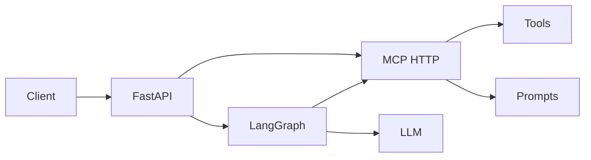

# Study Coach — API backend

**Study Coach** is a vertical AI platform built for **African education**: personalized tutoring that understands local programmes, **document intelligence** on your materials, and an architecture aimed at **offline-capable** use where connectivity is limited. We focus on Ghanaian learners (GES, SHS, WASSCE, tertiary) while staying relevant across the continent—making expert-level academic support more accessible **24/7** at a lower cost than traditional tutoring, without replacing teachers.

Under the hood this repo uses **FastAPI** for the HTTP API, **FastMCP** for tools and prompts over the [Model Context Protocol](https://modelcontextprotocol.io/), and **LangGraph** for the agent loop (reason → tool → observe → repeat) with optional checkpointed memory.

## Architecture

```text
Client
  |
  | POST /workflow
  v
FastAPI
  |
  | MCP Client (HTTP)
  v
FastMCP Server
  |        |
Tools   Prompts
  |
LangGraph Agent
```

- **MCP** = tool and prompt server (discoverable, centralized).
- **LangGraph** = orchestration and state (including `thread_id` for memory).
- **FastAPI** = public gateway (optional gate + rate limits; **`POST /workflow/stream`** for SSE token streaming).



## Features

- **Landing** at **`/`** (marketing page) and **`/assessment`** (short questionnaire → personalised **`/studio/chat`** on the Next app).
- **Next.js web UI** at **`/studio`** and **`/studio/chat`**: calls `POST /workflow` with optional **`learner_profile`** on the **first** turn of a new thread (assessment results), plus **`thread_id`** for memory. **`coaching_mode`**: `full` (default) or `hints` (shorter nudges).
- **Gate** at **`/gate`**: HTML form sets a session when **`APP_ACCESS_CODE`** is set; API clients can send **`X-App-Access-Code`** instead. The chat UI uses `credentials: "include"` so cookies work.
- **Service map** (JSON) at **`/service`** (formerly the root JSON).
- **Learning progress**: `thread_id` is stored in **localStorage** (survives tab close) and chat state in **SQLite** (`CHECKPOINT_SQLITE_PATH`, default `data/langgraph_checkpoints.db`) so students can continue after the API restarts. **`GET /workflow/history`** reloads past turns. Treat `thread_id` like a private link. With **`BIND_THREADS_TO_SESSION=true`**, the first session that uses a `thread_id` owns it (cross-device resume with the same learning ID still works if **`false`**).
- HTTP agent API with a workflow endpoint.
- MCP-defined tools (e.g. Wikipedia summaries, REST Countries).
- MCP-defined system prompts (no hardcoded prompts inside the graph).
- LangGraph conditional routing: chat node ↔ tool node until done.
- Optional **Redis**-backed MCP event store for persistence and stream limits.

## Prerequisites

- Python 3.11+ (recommended).
- [Redis](https://redis.io/) if you enable the MCP `EventStore` with `RedisStore`.
- An LLM API key (e.g. OpenAI or provider supported by your LangChain stack).

## Suggested layout

```text
fastapi-langgraph-mcp-agent/
├── Makefile                # dev-api, dev-web, check
├── README.md
├── pyproject.toml
├── .env.example
├── app/
│   ├── main.py             # App factory: middleware, mounts, include_router
│   ├── routers/            # Route modules (site, health, workflow, webhooks)
│   ├── schemas.py          # Pydantic API models
│   ├── workflow_ops.py     # LangGraph invoke, history, uploads, SSE
│   ├── limiting.py         # SlowAPI limiter
│   ├── lifespan.py         # SQLite checkpointer startup
│   ├── mcp_http.py         # Mounted FastMCP app
│   ├── static/             # Access gate HTML only (APP_ACCESS_CODE); marketing/chat live in frontend/
│   ├── mcp_server/server.py
│   └── workflows/graph.py
└── frontend/               # Next.js 15 (home, assessment, /studio)
```

## Next.js frontend (optional)

The **`frontend/`** directory is a **Next.js 15** app (App Router): landing page, multi-step **assessment**, and **`/studio`** workspace (dashboard + coach) that calls the same **`POST /workflow`**, **`POST /workflow/upload`**, and **`GET /workflow/history`** endpoints as the API.

1. Run the API (e.g. on **http://127.0.0.1:8000**).
2. Copy **`frontend/.env.local.example`** to **`frontend/.env.local`** and set **`NEXT_PUBLIC_API_URL`**.
3. From **`frontend/`**, run **`npm install`** then **`npm run dev`** (default **http://localhost:3000**).
4. Add that origin to FastAPI **`CORS_ORIGINS`**. If the API uses **`CLERK_ONLY_AUTH`**, set **`NEXT_PUBLIC_CLERK_PUBLISHABLE_KEY`** and **`CLERK_SECRET_KEY`** in **`.env.local`** and match **`CLERK_AUTHORIZED_PARTIES`** / Clerk dashboard URLs on the backend.

Set **`STUDY_COACH_FRONTEND_URL`** (e.g. `http://127.0.0.1:3000`) on the API so **`GET /`**, **`/assessment`**, and **`/chat`** redirect to the Next app (`/` and `/assessment` as-is, **`/chat` → `/studio/chat`**). Without it, those routes return a short HTML stub pointing at **`frontend/`**.

**Local dev (two terminals):** `make dev-api` and `make dev-web` (after `make install-web` and a configured **`.env`** / **`frontend/.env.local`**).

**Production:** deploy **`frontend/`** to Vercel (root directory `frontend`, set **`NEXT_PUBLIC_API_URL`** to your public API). Run the FastAPI app from the root **`Dockerfile`** on a host with a **persistent volume** for `/data` (SQLite) and **`SESSION_COOKIE_SECURE=true`**. Full steps: **[DEPLOY.md](DEPLOY.md)**.

**Studio UI:** **`/studio`** — dashboard with personalised starters, **`/studio/chat`** coach, **`/studio/timetable`** (**import** PDF / DOCX / images via **`POST /timetable/import`** with **`OPENAI_API_KEY`**; internal reference grid PNG aligns parsing; schedule shows in a **week calendar** beside **`/studio/chat`** only; **goals** for nudges sync from the **assessment** profile; prep/rest/focus nudges + optional **SendGrid**), **`/studio/library`** prompts (Study Coach dark/gold styling). Protected by Clerk when **`NEXT_PUBLIC_CLERK_PUBLISHABLE_KEY`** is set. Brand logo for emails: **`frontend/public/images/landing/kifinal.png`** (inline in HTML). Marketing images ship under **`frontend/public/images/landing/`**.

**If the UI breaks** (buttons dead, console **404** on `/_next/static/chunks/main-app.js` or **`app-pages-internals.js`**): stop the dev server, run **`npm run clean`** in **`frontend/`**, then **`npm run dev`** again. That usually means **`frontend/.next`** mixed a **`next build`** output with **`next dev`** or a stale cache.

## Configuration

| Variable | Purpose |
|----------|---------|
| `STUDY_COACH_FRONTEND_URL` | Next.js base URL for redirects from `/`, `/assessment`, legacy `/chat`, and post-gate flows. |
| `OPENAI_API_KEY` | LLM calls (example provider). |
| `REDIS_URL` | e.g. `redis://localhost:6379` for MCP event store. |
| `SESSION_SECRET` | Signs session cookies (use a long random value when using `/gate`). |
| `SESSION_COOKIE_SECURE` | If `true`, session cookies are HTTPS-only (use in production). |
| `APP_ACCESS_CODE` | If non-empty, enables gate + requires session or `X-App-Access-Code`. |
| `BIND_THREADS_TO_SESSION` | If `true`, locks each `thread_id` to the first browser session (see `.env.example`). |
| `THREAD_REGISTRY_DB_PATH` | SQLite file for thread ownership when bind is on. |
| `WORKFLOW_REQUESTS_PER_MINUTE` | Rate limit for `/workflow`, `/workflow/history`, `/workflow/stream`. |
| Host / port | Default development: `http://localhost:8000`. |

Copy `.env.example` to `.env` and fill values. Never commit secrets.

**Health**: **`GET /health`** liveness; **`GET /health/deps`** checks OpenAI config, checkpointer, and MCP HTTP reachability.

## Install

```bash
cd fastapi-langgraph-mcp-agent
python -m venv .venv
source .venv/bin/activate  # Windows: .venv\Scripts\activate
pip install -U pip
# pip install -e .   # if using pyproject.toml
# or: pip install -r requirements.txt
```

Dependencies (conceptual — pin versions in your lockfile):

- `fastapi`, `uvicorn[standard]`
- `langgraph`, `langchain-core`, `langchain-openai` (or your LLM package)
- `langchain-mcp-adapters` (`MultiServerMCPClient`, session helpers)
- `fastmcp`, `httpx`
- `wikipedia` (or replace with HTTP/API tools)
- Redis client / `key-value` store package as used by your FastMCP event store setup

## Run locally

1. Start Redis (if using event store):

   ```bash
   redis-server
   ```

2. Start the API (example):

   ```bash
   uvicorn app.main:app --reload --host 0.0.0.0 --port 8000
   ```

3. MCP is typically mounted under the same app (e.g. `/agent`); the MCP HTTP URL must match what `MultiServerMCPClient` uses (e.g. `http://localhost:8000/agent/mcp`).

4. Open the API: **landing** [http://localhost:8000/](http://localhost:8000/), **gate** [http://localhost:8000/gate](http://localhost:8000/gate) (when access code is set), **assessment** [http://localhost:8000/assessment](http://localhost:8000/assessment), legacy **chat** [http://localhost:8000/chat](http://localhost:8000/chat) — or use **Next.js** at [http://localhost:3000/studio](http://localhost:3000/studio); Swagger at `/docs`, JSON at `/service`.

## API usage

Example workflow invocation:

When **`APP_ACCESS_CODE`** is set, add `-H "X-App-Access-Code: …"` to the request.

```bash
curl -s -X POST "http://localhost:8000/workflow" \
  -H "Content-Type: application/json" \
  -d '{"message": "What is the capital of Ghana?"}'
```

Optional: **`learner_profile`** (first turn of a new `thread_id` only) personalises the coach — same shape as the browser assessment stores. Omit `thread_id` to start a fresh learning thread. Add **`"coaching_mode": "hints"`** for shorter hints.

```bash
curl -s -X POST "http://localhost:8000/workflow" \
  -H "Content-Type: application/json" \
  -d '{"message": "I need a two-week revision plan.", "learner_profile": {"education_level": "shs", "shs_track": "science", "subject_focus": "Mathematics", "region": "Greater Accra", "goals": "WASSCE Core Math"}}'
```

**Streaming** (`text/event-stream`): same JSON body as `POST /workflow` on **`POST /workflow/stream`**. Events: `token` (partial assistant text), optional trailing `token`(s) for the verification footer, `done` (`thread_id`, `agent_lane`, **`reply`** = full text including footer), `error`.

## MCP tools (examples)

| Tool | Role |
|------|------|
| `global_news` | Wikipedia summary for a query. |
| `get_countries_details` | REST Countries by name. |
| `get_currency` | REST Countries by currency code. |

Extend by registering new `@mcp.tool` functions; LangGraph picks them up via MCP for the session.

## MCP prompts

Define prompts with `@mcp.prompt` (e.g. `common_prompt`) and load them in the graph builder with `load_mcp_prompt` so product teams can iterate prompts without redeploying graph code (depending on your deployment model).

## LangGraph behavior

1. **chat node** — LLM with bound tools decides the next step.
2. **tool node** — `ToolNode` executes MCP-backed tools.
3. **Conditional edge** — if tools are needed, run tools and return to chat; else **END**.

Compile with a checkpointer (e.g. `MemorySaver()` for development; Postgres/SQLite checkpointers for production) and pass `configurable.thread_id` for conversation-scoped memory.

## Production considerations

- This template adds optional **gate** + **`X-App-Access-Code`** and **slowapi** limits on workflow routes; tighten further (API keys, JWT, mTLS) as needed.
- **Payload size limits** on FastAPI beyond the default.
- **Secrets** via env or a secret manager; never in MCP prompts committed to git.
- **Observability**: structured logs, tracing around MCP and LangGraph steps.
- **Redis** sizing and TTL (`ttl`, `max_events_per_stream`) for MCP event store.
- **LLM timeouts/retries** and cost controls.

## References

- [FastAPI](https://fastapi.tiangolo.com/)
- [LangGraph](https://langchain-ai.github.io/langgraph/)
- [LangChain MCP adapters](https://github.com/langchain-ai/langchain-mcp-adapters)
- [Model Context Protocol](https://modelcontextprotocol.io/)

## License

Specify your license here (e.g. MIT, Apache-2.0, or proprietary).
